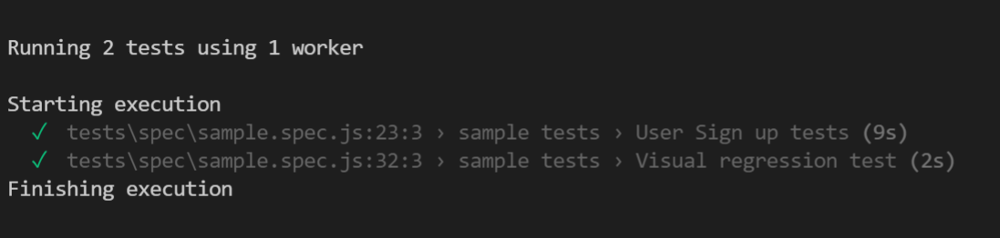

<p align="center">
   <i><strong>Playwright boiler plate
</strong></i>
<p>

## Playwright boiler plate

### NPM packages used
* @playwright - test library
* dotenv - for env file
* faker - to generate fake test data

### Features 
* All scripts written with JavaScript.
* Visual regression testing
* Neat folder structures with js files easy to maintain
* Component level breakdown of selectors.
* Component level test data from fixtures.

### To Get Started

#### Pre-requisites
* NodeJS installed globally in the system.
https://nodejs.org/en/download/
* Visual Studio Code or any

#### Setup Scripts
* Clone the repository into a folder
* Go inside the folder and run following command from terminal/command prompt
```
npm install 
```
* All the dependencies from package.json would be installed in node_modules folder.

#### Run Scripts

* Now just run the below command which starts the test execution in headed mode. 
```
npx playwright test --headed
```
By default this runs in headless
```
npx playwright test 
```
or
```
npm run test
```
we need to execute again if visual regression test fails. Since current run image will be saved as a base image and used for further runs.



#### Writing Selectors

selectors are in `selector.js` file in `utils` folder.

```
 exports.locator = {
  signup: {
    form: {
      get_started_label: "h1 >> text=Get started free today",
      sign_in: "a span >> text=Sign in",
    },
  },
};
```

#### Colors validation

colors are in `colors.js` file in `utils` folder
    
```
exports.colors= {
    get_started:  'rgb(66, 98, 255)',
    form_errors: 'rgb(255, 101, 117)'
}
```

#### Test data

Test data are in `testdata.js` inside `fixtures` folder

`faker` npm package is used to create fake test data 
```
const faker = require("faker");

exports.testdata = {
    signup:{
        testname: faker.internet.userName(),
        testemail : faker.internet.email(),
        testpassword: faker.internet.password(),
    }
}
```
#### Visual regression testing

For Image based comparison 

```
 test("Visual regression test", async ({ page }) => {
    expect(await page.screenshot()).toMatchSnapshot("signup.png", {
      threshold: 2.5,
    });
  });
```

#### env file

For generic env data like base url

```
url=https://--
```

#### Spec file

```
  test("User Sign up tests", async ({ page }) => {
    await expect(page).toHaveTitle('GitHub: Where the world builds software · GitHub');
    await expect($(email)).toBeVisible();
    await expect($(sign_up)).toBeEnabled();
    await $(email).type(testemail);
    await expect($(sign_up)).toHaveCSS("background-color", colors.sign_up);
    await expect($(email)).toHaveValue(testemail)
  });
```


#### Test Hooks
Test hooks in each spec file.
```
test.beforeAll(async () => {
    console.log('Starting execution')
});

test.beforeEach(async ({ page }) => {
    console.log('Starting execution')
});

test.afterEach(async ({ page }) => {
    console.log('Starting execution')
});

test.afterAll(async () => {
    console.log('Starting execution')
});

```
#### Docker 
Following DockerFile is used to create a docker image and run the container
```
FROM node:16-alpine3.14

WORKDIR /app

# copy project files
COPY . .

# dependencies will be installed only if the package.json file changes
RUN npm ci

# rerun E2E tests only if any of the previous files change
CMD npm run test

# Simple docker file just for demonstration. Advanced concepts to be included in docker compose or groovy script is jenkins pipeline
```